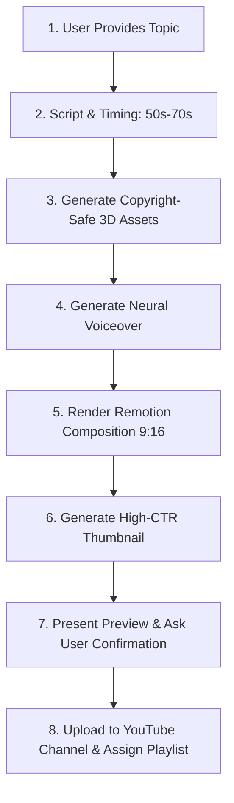

# YouTube Shorts Creator & Publisher Skill

Use this workflow whenever the user provides a topic, coding trick, mistake, tutorial, or concept to turn into a YouTube Short.

---

## Workflow Steps Overview



---

## Step 1: Script & Scene Timing (50s – 70s Standard)

Every generated Short must strictly target **50 to 70 seconds** (1,500 to 2,100 frames at 30 fps).

### Recommended Scene Structure:

| Scene # | Type | Duration | Frames (30fps) | Purpose |
| :--- | :--- | :--- | :--- | :--- |
| **1** | `studio_title` / `hook` | 6s – 8s | 180 – 240 | High-contrast hook question / 3D title card |
| **2** | `studio_slider` / `context` | 8s – 10s | 240 – 300 | Context, scope, or threshold explanation with 3D slider |
| **3** | `studio_prompt_mistake` / `problem` | 8s – 10s | 240 – 300 | What developers do wrong (with 3D red cross / badge) |
| **4** | `code` / `solution` | 10s – 14s | 300 – 420 | Clean, syntax-highlighted code or prompt solution |
| **5** | `studio_checklist` / `rules` | 8s – 10s | 240 – 300 | Technical edge-cases checklist with 3D asterisk |
| **6** | `tip` / `pro_takeaway` | 6s – 8s | 180 – 240 | Golden rule / architectural best practice |
| **7** | `cta` / `end_screen` | 6s – 8s | 180 – 240 | Call-to-action for `@CodeWithSundresh` |

**Total Duration:** 52s – 68s (1,560 – 2,040 frames).

---

## Step 2: 100% Copyright-Free Asset Generation

To prevent copyright claims and strikes:
1. **Never download third-party images or copyrighted clips.**
2. **Generate Custom 3D Icons with `generate_image`:**
   - Prompt format: `"3D rendered [object], matte clay and glossy plastic, clean studio lighting, isolated on solid white background, minimalist isometric tech design"`
   - Example objects:
     - Friendly robot head knob
     - Matte coral red cross mark
     - Mint green 8-point asterisk / starburst
     - Golden trophy / badge / warning sign
   - Post-process to transparent PNG if needed and save into `assets/images/` or `generated/images/`.
3. **Background Music:** Use bundled royalty-free tracks in `assets/music/` (e.g. `chill-lofi.mp3`).
4. **Sound Effects:** Use local synthetic SFX (`assets/audio/sfx/`).

---

## Step 3: Neural Voiceover (Tamil & English)

1. Use `edge-tts` for natural, broadcast-quality speech:
   - **Tamil Voice:** `ta-IN-ValluvarNeural` with speed `--rate=+18%`
   - **English Voice:** `en-US-ChristopherNeural` or Piper TTS
2. Route voice synthesis via [`audioService.ts`](file:///d:/Code%20Shorts%20Generator/codegen/backend/src/services/audioService.ts).
3. Set spoken narration in `voiceNarration` property of each scene, allowing concise on-screen subtitle pills while providing rich, natural verbal explanation.
4. Synchronize audio entry with a 12-frame (0.4s) offset to match Remotion spring entrance animations.

---

## Step 4: High-CTR Thumbnail Generation

Generate a dedicated YouTube Shorts thumbnail (9:16 or 16:9) using `generate_image`:
- **Prompt Guidelines:**
  - Bold, prominent 3D subject centered in frame.
  - Dark studio gradient background (deep navy `#0f172a` or slate green `#1c2d25`).
  - Highly readable, punchy hook text (max 3–4 words).
  - High contrast, cinematic ambient lighting.
- Save to `generated/thumbnails/thumb_<project_id>.jpg`.

---

## Step 5: User Confirmation Before Upload

**NEVER upload silently without asking.**
After rendering the video:
1. Extract preview frame screenshots using `ffmpeg`.
2. Present to the user:
   - Video file path & duration.
   - Preview frame images and thumbnail image.
   - Proposed YouTube Title, Description, and Tags.
3. Ask the user using `ask_question`:
   - Confirm upload to **CodeWithSundresh** (@CodeWithSundresh).
   - Select privacy status: `Unlisted` (recommended for first review) or `Public`.
   - Confirm target playlist.

---

## Step 6: YouTube Upload & Playlist Assignment

Upload using the backend YouTube service ([`youtubeService.ts`](file:///d:/Code%20Shorts%20Generator/codegen/backend/src/services/youtubeService.ts)):

```ts
import { uploadVideo, getPlaylists } from '../backend/src/services/youtubeService.js';

// 1. Fetch playlists to map topic
const playlists = await getPlaylists();
// e.g. find matching playlist: "Claude Code", "AI Dev Tutorials", etc.
const targetPlaylist = playlists.find(p => p.title.toLowerCase().includes(topicKeyword))?.id;

// 2. Upload with rich metadata and thumbnail
const result = await uploadVideo({
  filePath: videoPath,
  title: `${catchyTitle} #shorts`,
  description: formattedDescription,
  tags: topicTags,
  privacyStatus: selectedPrivacy, // 'unlisted' | 'public'
  playlistId: targetPlaylist,
  thumbnailPath: thumbnailPath,
});
```

### Metadata Template:
- **Title:** Catchy hook (under 100 characters), ending with `#shorts`.
- **Description:**
  ```text
  [Tamil Hook & Explanation Summary]
  
  📌 Key Takeaways:
  1️⃣ [Step 1]
  2️⃣ [Step 2]
  3️⃣ [Step 3]

  Subscribe to @CodeWithSundresh for daily AI coding & tech tutorials!
  
  #shorts #coding #developer #tech #[topic]
  ```
- **Category:** `28` (Science & Technology).
- **Target Audience:** `selfDeclaredMadeForKids: false`.
