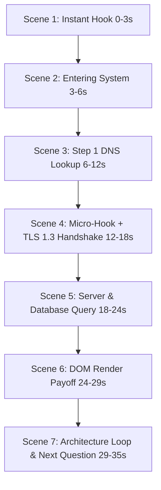

# CodeWithSundresh — Animated Tech Shorts Creator Skill

Use this skill whenever the user provides a technology question, system architecture concept, or "How It Works" topic (e.g. *What happens when you type google.com?*, *How DNS works*, *What happens when you click Login?*, *How online payment works*, *Docker explained*).

All voiceover and text must be in **clear, energetic, developer-focused English** (`en-US-ChristopherNeural` at `--rate=+10%`).
Audio and visuals must be **100% synchronized** with dynamic scene duration padding.

---

## Master Retention Rules (STRICT)
1. **No blank/intro animation during the first 0.5 seconds.** Core subject visible immediately at frame 0.
2. **Show the core subject immediately.** Zero title screens, logos, or slow fades.
3. **First curiosity question must appear within 1 second.**
4. **Do not keep a visually identical scene for more than 1.5–2 seconds.**
5. **Every 2–3 seconds introduce a meaningful visual change** (camera push, packet travel, node pulse).
6. **Every major step must show actual movement of data/information.**
7. **Create a new curiosity question before revealing the next technical step.**
8. **Do not use decorative images for more than 1–2 seconds** unless actively contributing to the story.
9. **Remove fake precision such as invented latency numbers** (NO arbitrary `14ms`, `22ms`, `64ms`).
10. **Do not present illustrative technical values as real measurements.** Use accurate protocol labels (`TLS 1.3`, `HTTP/3`, `UDP/53`).
11. **Verify technical relationships between components before animation.**
12. **Keep the explanation focused on ONE core question.**
13. **Target 25–35 seconds for simple concepts** (750–1,050 frames at 30 fps).
14. **Audio & visual must be 100% synchronized.** Remotion sequences clamped to prevent bleeding.
15. **Keep technical terms in English** (*DNS, API, TLS, HTTP, Server, Database, Docker, AI, etc.*).
16. **Use micro-hooks throughout the video:**
    - *"But..."*
    - *"Here's the interesting part..."*
    - *"Wait..."*
    - *"We're not done yet..."*
    - *"But how?"*
    - *"Now something important happens..."*
17. **End with a new unanswered technical question** that can become the next video.
18. **Make the video loop naturally whenever possible.**

---

## The 7-Scene Master Story Structure (25–35s / 750–1,050 frames)



---

## 10 Core Topic Scene Recipes

### 1. What happens when you type google.com?
- **Hook (0–3s):** Browser address bar + Enter key press. *"You type google.com and press Enter. What actually happens in the next one second?"*
- **Action (3–6s):** Camera dives into network infrastructure. *"Before the page appears, your request travels thousands of miles across global fiber."*
- **Technical Flow (6–24s):**
  - Step 1: Browser ➔ DNS Resolver (`"What is google.com IP?"` — DNS returns `142.250.190.46` via UDP 53)
  - Micro-hook + Step 2: *"Here's the interesting part..."* Browser ➔ Edge Server (TLS 1.3 encrypted handshake established)
  - Step 3: Web Server ➔ Search Database (Fetches page payload and streams HTML/CSS back via HTTP/3)
- **Payoff (24–29s):** Google homepage renders smoothly. *"DOM parsed and rendered—all in a fraction of a second!"*
- **Takeaway & Loop (29–35s):** Full pipeline `YOU ➔ DNS ➔ SERVER ➔ DB ➔ RENDER`.
  - *"That's the basic flow. But how does that request physically travel through undersea cables? That brings us to..."* 🔄
- **Big Takeaway (26–31s):** Full pipeline `YOU ➔ DNS ➔ SERVER ➔ DB ➔ RENDER`.
- **Loop (31–35s):** *"That's the basic flow. But how does that data physically travel through undersea cables? That brings us to..."* 🔄

### 2. What happens when you send a WhatsApp message?
- **Hook (0–2s):** Chat bubble sent with single grey tick.
- **Action (2–5s):** Typing message, send button click.
- **Technical Flow (5–19s):**
  - Signal Protocol encryption: Message locked with asymmetric public key 🔒
  - Phone ➔ WhatsApp Erlang server (transits without reading payload)
  - Erlang server ➔ Apple/Google Push Notification service (APNs / FCM)
  - Recipient phone wakes up, private key decrypts payload 🔓
- **Payoff (19–25s):** Double tick turns glowing blue!
- **Takeaway & Loop (25–35s):** Full end-to-end encryption pipeline + teasing group chat ratchet.

### 3. What happens when you enter your password?
- **Hook (0–2s):** Password field `••••••••` + Login button.
- **Action (2–5s):** Enter password, submit triggers.
- **Technical Flow (5–19s):**
  - Plaintext NEVER stored! Network sends via TLS 1.3.
  - Server adds unique cryptographic Salt (`$2a$12$...`).
  - Argon2id / bcrypt runs 10,000 hashing rounds.
  - Constant-time hash verification against database.
- **Payoff (19–25s):** Green `ACCESS GRANTED` + JWT session token generated.
- **Takeaway & Loop (25–35s):** Salt + Hash architecture summary + rainbow table teaser.

### 4. What happens when you make an online payment?
- **Hook (0–2s):** Card / UPI checkout screen + "Pay ₹999".
- **Technical Flow (5–19s):**
  - Card Tokenization (PAN replaced with single-use cryptogram)
  - Payment Gateway ➔ Acquirer Bank ➔ Card Network (NPCI/Visa/Mastercard)
  - Issuing Bank fraud detection + 2FA SMS/Push
  - Settlement ledger balance debit/credit
- **Payoff (19–25s):** Green payment success animation + webhook confirmation.

---

## Visual Assets & Image Generation Rules

1. **Target 2–5 Generated Images:** Never generate images for every scene. Combine animations with generated conceptual environments.
2. **Standard Image Prompt Format:**
   ```text
   Subject: [e.g. futuristic global internet infrastructure with glowing fiber routes]
   Style: Premium cinematic 3D technology visualization, clean studio lighting
   Colors: Obsidian background #080B0A, warm off-white #F5F2E8, electric mint green accents #78E08F
   Composition: Vertical 9:16, central subject with safe margins for programmatic text overlay
   Avoid: text, typography, logos, watermarks, human faces, cheesy AI robots
   ```
3. **Programmatic Text Only:** NEVER generate text inside images. All labels, metrics, and captions are rendered programmatically with sharp typography.
4. **Subtle Motion:** Apply `scale(1.00)` to `scale(1.08)` zoom, floating drift, and ambient particles.

---

## Audio Pipeline

- **Tamil TTS:** Microsoft Edge Neural TTS (`ta-IN-ValluvarNeural` at `--rate=+18%`).
- **Sound Effects:**
  - Keyboard typing: `sfx_typing`
  - Packet travel: digital whoosh
  - Node hit: subtle confirmation chime
- **Music:** Bundled lo-fi / tech music (`chill-lofi.mp3`) at 10–12% volume.
